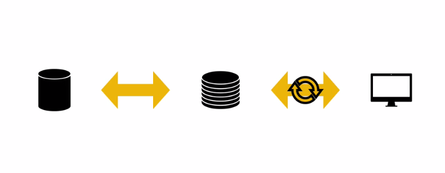
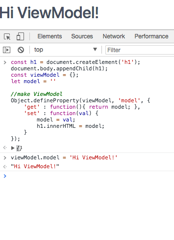

## 1. MVVM 모델

<span style="color:#555555">: MVVM 패턴의 ViewModel 레이어에 해당하는 View 라이브러리</span>
<span style="color:#555555"></span>

## 2\. MVVM 구조

MV에, `C(Controller)가 아닌 VM(ViewModel)`입니다.

구조상으로 보면, 모델과 뷰 사이에 위치하고 있습니다.
모델로부터 어떤 데이터를 가져오는데, 그 데이터는 뷰에 적한한 형태의 데이터로 가공됩니다.
그래서 뷰 모델이 변경될때마다 자동으로 그것과 연될되어있는 뷰화면에 반영이 되죠.
그렇기때문에 모델보다는 좀 더 뷰에 적합한 모델이라고 보시면 됩니다. 그래서 이름도 `ViewModel`이라고 한 것 같습니다.
이렇게 Vue.js는 ViewModel을 이용하여 뷰모델이 변경됨에 따라서, 자동으로 화면에 갱신되어지고 있습니다.

## 3\. `ViewModel`을 직접 체험해보기

<span style="color:#555555">: 어떻게 뷰모델이 변경됨에 따라서, 자동으로 화면에 갱신이 되는지 확인해보겠습니다.</span>

### 3.1. Chrome으로 ViewModel 만들기

<span style="color:#555555">: 아래 소스를 chrome console에 copy 하신 후 실행해보시면, 아래와 같이 확인해 보실 수 있습니다.</span>

```javascript
const h1 = document.createElement('h1');
document.body.appendChild(h1);
const viewModel = {};
let model = ''

//make ViewModel
Object.defineProperty(viewModel,'model', {
'get' : function(){ return model; },
'set' : function(val) {
model = val;
h1.innerHTML = model;
}
});

//check ViewModel
viewModel.model = 'Hi ViewModel!'
```

<span style="color:#555555"></span>

### 3.2. ViewModel 값 입력 후, 출력 내용 확인 해보기 1

<span style="color:#555555">: 이러면, 뷰모델이 변경됨에 따라서, `자동으로 화면에 'Hi NHN godo!'가 갱신` 되는것을 볼 수 있습니다.</span>

```javascript
viewModel.model  = 'Hi ViewModel!'
>> "Hi ViewModel!"

viewModel.model  = 'merong?!'

>>>
"merong"

```
<span style="color:#555555"></span>